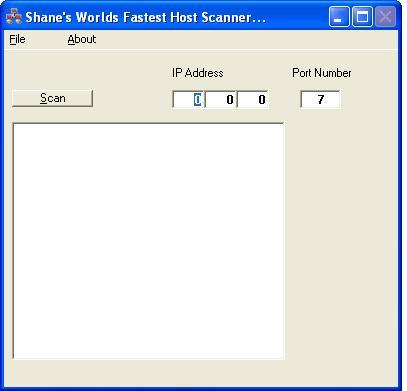



## UDP Ping

### Description

This util will UDP Ping 254 IP's in under 3 seconds. Unlike TCP Pings which can take a minute or more. This util will scan a whole IP range quickly telling you which machines on the LAN or internet are alive. umm, since ocx's aren't allowed to be u/l i have had to delete the ocx fromt he zip. In the code just delete any reference to the ocx. The ocx is only a gif animation thing so isn't needed for this util to function. If you would like the full version then d/l at http://www.iamalive.0catch.com/VBstuff/vb.htm
 
### More Info
 
Just an IP address xxx.xxx.xxx

umm, since ocx's aren't allowed to be u/l i have had to delete the ocx fromt he zip. In the code just delete any reference to the ocx. The ocx is only a gif animation thing so isn't needed for this util to function. If you would like the full version then d/l at http://www.iamalive.0catch.com/VBstuff/vb.htm

             |
---                |---
**Submitted On**   |2003-01-03 21:50:16
**By**             |[Shane Wallis](https://github.com/Planet-Source-Code/PSCIndex/blob/master/ByAuthor/shane-wallis.md)
**Level**          |Intermediate
**User Rating**    |5.0 (15 globes from 3 users)
**Compatibility**  |VB 6\.0
**Category**       |[Miscellaneous](https://github.com/Planet-Source-Code/PSCIndex/blob/master/ByCategory/miscellaneous__1-1.md)
**World**          |[Visual Basic](https://github.com/Planet-Source-Code/PSCIndex/blob/master/ByWorld/visual-basic.md)
**Archive File**   |[UDP\_Ping1529881162003\.zip](https://github.com/Planet-Source-Code/shane-wallis-udp-ping__1-42468/archive/master.zip)

